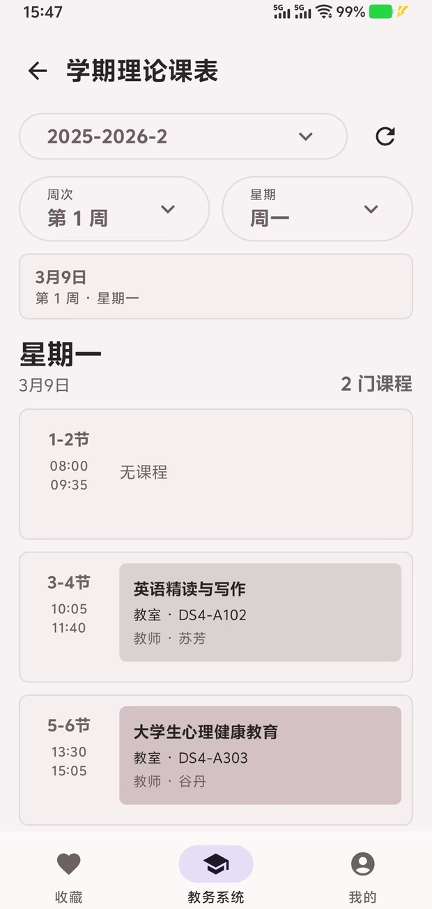
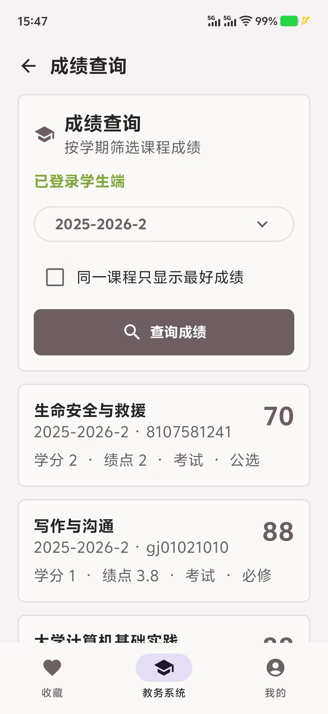
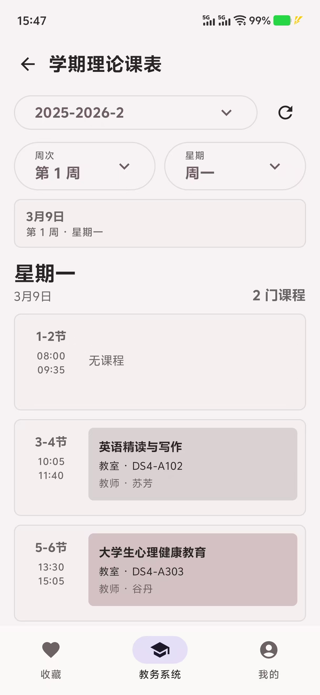

<h1 align="center">CCIT Academic</h1>

 
 

面向长春工程学院学生的<strong>第三方 Android 教务平台客户端</strong>

通过学校 WebVPN 登录，更方便地在手机上查询成绩和使用校园教务功能。

## 介绍

CCIT Academic 是一款面向长春工程学院学生的 Android 客户端。

应用通过学校 WebVPN 访问校内服务，为学生提供更加方便的移动端使用体验。目前主要支持 教务系统。

> 本项目为学生开发的第三方非官方客户端，与长春工程学院及学校相关系统的官方运营方无隶属或合作关系。

## 主要功能

* WebVPN 账号登录
* 课表查询
* 成绩查询
* 便捷使用教务系统
* 多账号保存与切换
* 本机加密保存账号密码
* 主动退出登录
* Material 3 原生界面

点点Star⭐，求求啦~

## 下载

* [GitHub Releases](https://github.com/aquasofts/CCIT-Academic/releases)
* [查看项目源码](https://github.com/aquasofts/CCIT-Academic)

请优先从 GitHub Releases 下载最新版本。

若 Releases 页面暂时没有安装包，说明应用仍处于开发或测试阶段。

## 使用教程

### 1. 安装应用

从 [GitHub Releases](https://github.com/aquasofts/CCIT-Academic/releases) 下载最新的 APK 文件。

下载完成后打开 APK，并根据 Android 系统提示完成安装。

如果系统提示“不允许安装未知应用”，需要临时允许浏览器或文件管理器安装应用。

### 2. 登录 WebVPN

打开应用后：

1. 输入学校 WebVPN 账号。
2. 输入对应密码。
3. 输入页面显示的图形验证码。
4. 根据需要勾选“在本机加密保存此账号和密码”。
5. 点击登录。

登录成功后，应用会保存当前登录会话。下次打开应用时，如果学校会话仍然有效，通常不需要重新登录。

### 3. 登录学生端

WebVPN 登录成功后，进入成绩查询页面。

1. 输入学生端账号和密码。
2. 输入学生端独立验证码。
3. 点击登录。
4. 等待应用获取学期信息。

如果此前已经主动保存过相同账号的密码，可以选择使用本机加密保存的凭据。

### 4. 切换账号

如果已经保存了多个账号：

1. 返回登录页面。
2. 打开账号选择列表。
3. 选择需要使用的账号。
4. 输入新的验证码。
5. 点击登录。

应用最多保存最近使用的 10 个账号，也可以在账号列表中单独删除某个账号。

### 5. 退出登录

在应用中点击“退出登录”后，当前登录会话会被清除，并返回登录页面。

主动退出登录不会自动删除之前保存的账号。若需要彻底移除账号信息，请在账号列表中手动删除。

### 为什么成绩没有显示或显示异常？

应用需要解析学校返回的成绩页面。如果学校调整了网页结构、字段名称或登录方式，可能会导致部分功能暂时不可用。

遇到此类情况时，请先通过学校官方教务系统查询，并等待应用适配。

## 说明

**本项目仅用于学习、交流和方便本人及获得授权的用户访问学校服务。**

使用者应遵守学校相关规定及法律法规。请勿使用本项目进行：

* 未经允许访问他人账号
* 批量尝试账号或密码
* 绕过验证码或身份认证
* 高频请求学校服务器
* 收集、公开或出售学生个人信息
* 干扰学校系统正常运行
* 其他未经授权的行为

## 免责声明

CCIT Academic 是第三方非官方客户端，不代表长春工程学院。

学校系统的接口、登录方式、网页结构和安全策略可能随时调整，因此本应用无法保证所有功能始终可用。

因学校系统升级、网络故障、设备环境、用户操作或第三方服务变化造成的问题，开发者不承担相应责任。

涉及选课、考试、成绩认定、学籍管理等重要事项时，请务必以学校官方通知和官方系统中的信息为准。
